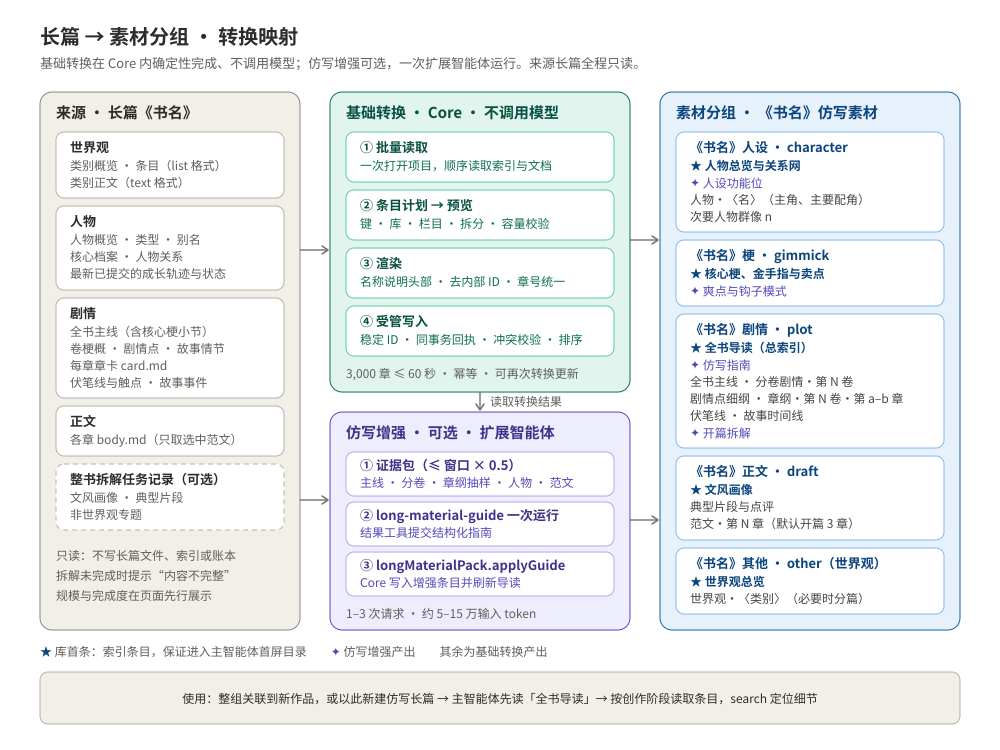
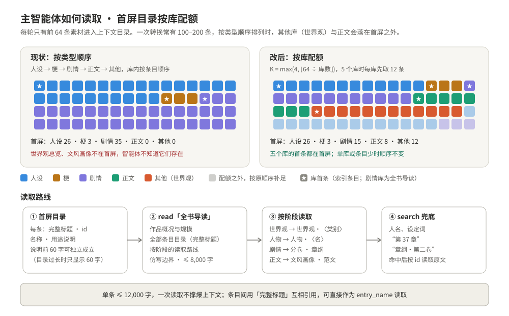
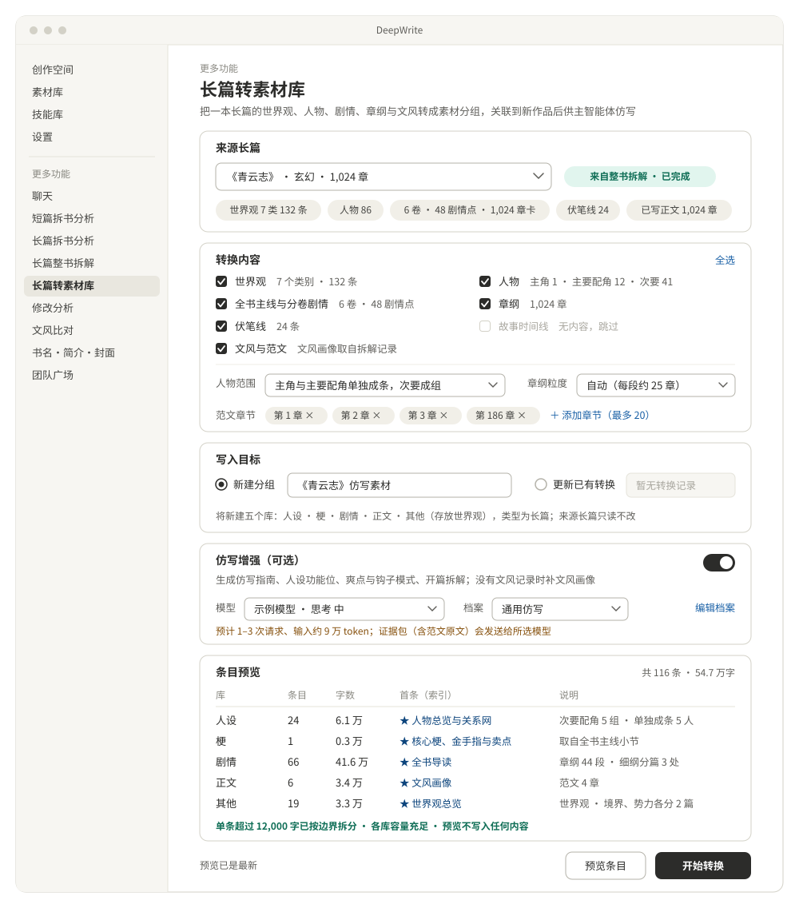
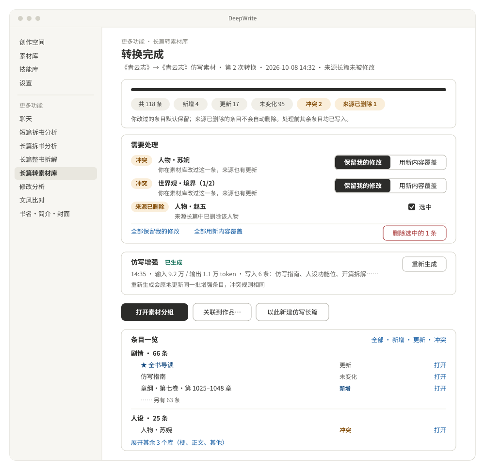

# 长篇转素材库功能设计

> 状态：第 2 节的决定已于 2026-10-08 确认；一期 M0–M5 已于同日实现，实现记录与验证见第 15 节。本文是实现依据，后续修改如需偏离，先改本文再改代码。

> 一句话：把创作空间里的一本长篇——尤其是“长篇整书拆解·续写模式”拆出来的书——转成一个素材分组。转换保留世界观、人物、剧情、章纲、伏笔与文风，并按主智能体的读取方式组织条目。新作品关联这个分组后，主智能体可以直接参照原书仿写。

## 1 背景与目标

现在把一本书变成可仿写的素材，有两条路，都不顺手：

| | 整书拆解·素材模式（已有） | 整书拆解·续写模式（已有） | 长篇转素材库（新） |
| --- | --- | --- | --- |
| 输入 | 原文 TXT/文件夹 | 原文 TXT/文件夹 | 创作空间里已有的长篇 |
| 模型调用 | 通读、整合、审校全程 | 通读、整合、审校全程 | 基础转换不调用；仿写增强可选，只需一次运行 |
| 产出 | 素材分组 | 可续写的长篇 | 面向仿写的素材分组 |
| 章级信息 | 只有分卷剧情 | 每章章卡 | 章纲按章保留 |
| 条目说明 | 无 name/description 头部，目录里只能显示正文摘录 | — | 每条都有名称和用途说明 |
| 首屏可见性 | 条目多时，世界观与文风落在主智能体首屏目录之外 | — | 每个库的索引条目都在首屏（第 6.5 节） |

典型场景：

1. 用户已用续写模式拆完一本书，通读费用已经付过；现在还想要一份素材库来仿写，不应再跑一遍整合。
2. 用户通过“导入续写”或手动整理出一本长篇，想把它的设定、人设和结构沉淀为可复用素材。
3. 用户拿自己的旧作，作为新书的风格与结构参照。

一期目标：

- 任意一本长篇都能生成一个素材分组，含五个“长篇”类型素材库：人设、梗、剧情、正文、其他（世界观放在“其他”库）。转换完整保留以下内容：
  - 世界观：类别概览与条目；
  - 人物：核心档案、关系、成长轨迹、最新状态；
  - 剧情：全书主线、卷、剧情点、故事情节、伏笔线、故事时间线；
  - 章纲：每章章卡；
  - 精选范文。

  来源由整书拆解生成时，任务记录中的文风画像、典型片段与专题一并带入。
- 基础转换完全确定：不调用模型，不产生费用，三千章的书一分钟内完成。
- 条目遵循第 6 节的“主智能体读取规范”：每条有名称和用途说明，大小可控，每库首条是索引，剧情库首条是全书导读，条目之间的引用可直接用于读取。
- 可选的仿写增强只需一次扩展智能体运行，生成仿写指南、人设功能位、爽点与钩子模式、开篇拆解；缺少文风画像时一并补上。
- 同一来源可以再次转换，原地更新本功能写入的条目；用户改过的条目不被覆盖。
- 完成后可一键关联到已有作品，或直接以此新建仿写长篇。

一期不做：

- 修改来源长篇；
- 整书正文入库；
- 自动把素材改写成新设定（换名、换皮）；
- 以短篇、剧本为来源；
- 转成技能库；
- 跨设备同步转换记录（条目本身随素材库正常同步）。

## 2 设计决定（2026-10-08 已确认）

| # | 决定 | 说明 |
| --- | --- | --- |
| 1 | 基础转换不调用模型 | 长篇里的设计已经是结构化成品，直接投影成素材即可。模型只用于仿写指南这类需要抽象归纳的内容 |
| 2 | 一个来源对应一个分组和五个库 | 库名为《书名》人设、梗、剧情、正文、其他，类型均为“长篇”。沿用素材分组的整组关联，新作品一步关联 |
| 3 | 条目遵循读取规范 | 每条有名称和用途说明头部；单条不超过 12,000 字；每库首条为索引，剧情库首条为全书导读；正文不出现内部 ID |
| 4 | 来源只读 | Core 只读取长篇，不写入来源长篇的任何文件、索引或账本 |
| 5 | 转换可更新 | 条目 ID 由“转换记录 + 来源对象键”确定。再次转换只更新本功能写入、且用户没改过的条目 |
| 6 | 素材目录首屏按库分配 | 这是对共享机制的小改：关联多个库时，首屏 64 条按库分配配额，保证每个库的索引条目可见（第 6.5 节） |
| 7 | 范文只取精选章节 | 默认取开篇 3 章，最多可手选 20 章；不整书入库 |
| 8 | 复用拆解成果 | 来源由整书拆解生成时，自动带入该任务记录里的文风画像、典型片段和非世界观专题 |
| 9 | 世界观放进“其他”库 | 库名沿用《书名》其他，素材类型 `other`，与整书拆解素材模式一致。库介绍、首条“世界观总览”的说明和“世界观·”条目前缀写明这里存的是世界观（第 4.1 节） |

## 3 用户流程



入口：

- 侧边栏“更多功能”在“长篇整书拆解”之后新增「长篇转素材库」，页面按需加载，可在“更多功能”设置中隐藏。
- 整书拆解（续写模式）的完成页增加“转为素材库”按钮，打开本页时已选好这本书。

步骤：

1. **选择长篇**：`PopupSelect` 列出全部长篇。选中后显示规模：世界观类别与条目数、各类型人物数、卷/剧情点/章卡数、伏笔线数、已写正文章数，以及是否来自整书拆解、拆解是否已完成。
2. **选择内容**：共七项，默认全选，见第 8 节。另有三项设置：人物范围、章纲粒度、范文章节。
3. **选择目标**：新建分组（默认名《书名》仿写素材，重名自动加序号），或更新这本书已有的某次转换。
4. **预览条目**：Core 生成条目计划，按库列出条目名、字数、拆分情况，并检查容量。预览只读，不写入任何内容。
5. **开始转换**：显示写入进度；完成后进入结果页（第 8 节）。
6. **仿写增强（可选）**：可以在开始前勾选、随转换一起运行，也可以在结果页单独运行。
7. **投入使用**，两种方式任选：
   - “关联到作品…”：在结果页选择一部作品（长篇、短篇或剧本）后点“关联”，与资源关联弹窗的分组模式一样，用本分组的五个库替换该作品五类素材的关联。
   - “以此新建仿写长篇”：新建长篇时带上本分组的关联（`CreateLongBookInput.linkedMaterialIdsByKind`），然后打开创作空间。

## 4 转换映射

### 4.1 分组与库

| 库 | 素材类型 | 首条（库索引） | 其余条目 |
| --- | --- | --- | --- |
| 《书名》人设 | `character` | 人物总览与关系网 | 人物·〈名〉；群像·次要人物 n；人设功能位（增强） |
| 《书名》梗 | `gimmick` | 核心梗、金手指与卖点 | 爽点与钩子模式（增强） |
| 《书名》剧情 | `plot` | 全书导读（总索引） | 仿写指南（增强）、全书主线、分卷剧情、剧情点细纲、章纲、伏笔线、故事时间线、开篇拆解（增强） |
| 《书名》正文 | `draft` | 文风画像 | 典型片段与点评、范文·第 N 章 · 〈标题〉 |
| 《书名》其他 | `other` | 世界观总览 | 世界观·〈类别〉（必要时分篇） |

库介绍是写给人看的，内容为来源、转换时间和条目索引。主智能体的素材目录不包含库介绍，所以索引另外作为每库首条条目提供。

“其他”库只放世界观，库名本身看不出这一点，所以在三处写明，人和智能体都不会误判：

| 位置 | 写法 |
| --- | --- |
| 库介绍首行 | “本库存放《书名》的世界观设定：规则、势力、地理、境界等类别的概览与条目。” |
| 首条“世界观总览”的说明 | 以“《书名》世界观总览”开头，说明“列出全部世界观类别与条目；设计世界观、力量体系或势力时先读”，前 60 字内讲清 |
| 条目名 | 一律以“世界观·”开头，如“世界观·境界”“世界观·势力（1/2）”；目录行里能直接看出是世界观 |

全书导读的条目目录也按“世界观（《书名》其他）”单列一节。

### 4.2 条目来源与规则

| 条目 | 库 / 栏目 | 来源 | 内容与拆分 |
| --- | --- | --- | --- |
| 全书导读 | 剧情 / 剧情设计 `pacing` | 生成 | 按第 6.3 节模板生成，不超过 8,000 字 |
| 全书主线 | 剧情 / `pacing` | `book_line` | 原文照录。“核心梗/金手指/卖点”小节移到梗库，这里只留一行引用 |
| 分卷·第 N 卷 〈卷名〉 | 剧情 / 剧情细化 `plot_refine` | 卷梗概，以及卷内剧情点的标题、章节范围、摘要 | 每卷一条，过长时拆成上下篇 |
| 细纲·第 N 卷 〈卷名〉 | 剧情 / `plot_refine` | 剧情点大纲与故事情节正文 | 有内容才生成；按剧情点边界分篇 |
| 章纲·第 N 卷·第 a–b 章 | 剧情 / `plot_refine` | 每章章卡 `card.md` | 每章写作“### 第 k 章 〈标题〉”加章卡正文。分段规则：首次转换按平均字数算出每段章数并存入转换记录，之后更新时沿用；分段不跨卷 |
| 伏笔线 | 剧情 / `pacing` | 伏笔线与触点 | 每条线写核心问题、隐藏真相、读者效果、跨度、状态，以及触点（类型、第 N 章、说明）。过长时按线分篇 |
| 故事时间线 | 剧情 / `plot_refine` | 故事事件与事件关系 | 有事件时才生成 |
| 人物总览与关系网 | 人设 / `character` | 人物概览、全部人物 | 包括人物概览原文、按类型排列的全部人物名单（名、别名、一句话定位）和主要关系摘要。路人只出现在名单里 |
| 人物·〈名〉 | 人设 / `character` | `core_profile`、`relationships`，以及最新已提交的 `history`、`current_state` | 主角、主要配角一人一条，小节固定（第 6.4 节） |
| 群像·次要人物 n | 人设 / `character` | 同上 | 次要配角与自定义类型的人物每 10 人一条；单人超过 3,000 字时单独成条 |
| 核心梗、金手指与卖点 | 梗 / `gimmick` | 全书主线中的“核心梗/金手指/卖点”小节，或由增强生成 | 都没有时不建这一条（空条目对智能体不可见） |
| 世界观总览 | 其他 / `other` | 各类别概览首段、条目名单 | 不超过 6,000 字 |
| 世界观·〈类别〉 | 其他 / `other` | 类别概览与条目（list 格式），或类别正文（text 格式） | 超过上限时按条目边界分篇（1/3…）；单个条目超过 6,000 字时单独成条，命名为“世界观·〈类别〉·〈条目〉” |
| 文风画像、典型片段与点评 | 正文 / 优秀正文片段 `draft_excerpt` | 拆解任务记录的 `style:profile`，或由增强生成 | 既没有来源、也没开增强时不建；导读中注明 |
| 范文·第 N 章 · 〈标题〉 | 正文 / `draft_excerpt` | 正文 `body.md` | 只取选中章节；超长章按段落分篇 |
| 专题·〈标题〉 | 按领域分到对应库 | 拆解任务记录的 `topic:*` | 世界观专题已在长篇世界观中，不重复转换 |

章号与卷号统一按全书叙事顺序编号（先卷序，再卷内叙事顺序），与长篇导出的排序口径一致。

### 4.3 内容清洗

- 去掉内部 ID、文件路径和机器字段；人物、剧情点、事件的引用一律转成名称。
- 统一写作“第 N 章”。伏笔触点类型和执行状态转成中文：埋设、加强、误导、部分揭示、揭示、回收、余波；计划中、已发生、未兑现。
- 空文档跳过，空小节省略。
- 来源 Markdown 的标题整体下沉一级（`#` 变为 `##`），避免与条目标题冲突。

## 5 仿写增强（可选）

### 5.1 产出

| 条目 | 库 / 位置 | 内容 |
| --- | --- | --- |
| 仿写指南 | 剧情 / `pacing`，紧跟导读 | 内容如下：<br>- 一句话卖点与读者预期；<br>- 分卷功能与冲突升级方式；<br>- 高潮与爽点节拍（平均间隔、类型）；<br>- 章末钩子类型；<br>- “可迁移的骨架”与“必须替换的表层”两份清单；<br>- 分阶段的仿写步骤 |
| 人设功能位 | 人设，紧跟人物总览 | 每个原作人物对应一个功能位（主角、导师、宿敌、红颜、对照组……），写明可迁移的性格与关系张力、必须替换的表层设定 |
| 爽点与钩子模式 | 梗 | 爽点类型、触发结构和典型兑现节奏 |
| 开篇拆解 | 剧情 / 导语设计 `intro` | 前 3 章的开场钩子、信息投放顺序、金手指出现时机和第一个小高潮 |
| 文风画像、典型片段与点评 | 正文 | 只在没有拆解文风记录时生成 |
| 核心梗、金手指与卖点 | 梗 | 只在全书主线里没有对应小节时生成 |

### 5.2 运行

- 新增扩展智能体 `long-material-guide`，属于 `ExtrasTaskAgentDefinition`（一次性任务），经 `extrasAgent.run` 进入扩展域；用量记到 `long-material-pack` 模块。
- 输入只传 `{ packId }`。Main 的 `task-resolver` 让 Core 组装证据包，内容包括：
  - 全书主线与分卷剧情；
  - 章纲，按预算均匀抽样；
  - 人物总览，以及主角、主要配角的档案；
  - 世界观总览；
  - 开篇 3 章和选中范文的原文；
  - 已有的文风画像。

  证据包不超过模型窗口的一半，沿用 `decompositionEvidenceBudget` 的口径；超出时按章节均匀抽样，并在包内注明抽样比例。运行前在 Renderer、Main、Agent 三处经 `assertExtrasAgentBudget` 预检与复核。
- 不提供读取工具：证据随任务一次给全，模型只调用一次结果工具 `submit_imitation_guide`。预计 1–3 次请求、输入 5–15 万 token。Faux 给出固定结构的结果。
- 系统提示词由两部分组成：档案提示词（内置“通用仿写”档案，侧重说明可编辑），加上不可编辑的【仿写指南运行边界】。边界的内容是：只依据证据；不复述原文长句；明确区分骨架与表层；推断内容要标注。
- 结果经 `extras_agent.output_updated` 回到页面，页面再调用 `longMaterialPack.applyGuide`。Core 把这次提交存进转换记录（`guide.submission`），再按同一套转换流程重建全部条目：增强条目（键为 `enhance:*`）和导读一起写入，冲突规则与第 7 节一致。
- 之后每次再转换都从记录里的提交重建增强条目，所以增强条目不会变成“不再生成”；单独重跑时，原地更新同一批增强条目。
- 页面右上角的“模型设置”选择仿写增强用的模型与思考档位；“侧重说明”就是档案的提示词，编辑后自动保存。
- 开始前提示用户：增强运行会把证据包（含范文原文）发给所选模型。基础转换不外发任何内容。

## 6 主智能体读取规范

这一节是本功能的核心：条目不只是“存进去”，而是让主智能体能找到、读得动、用得对。

### 6.1 现有读取机制

- 作品按素材类型关联素材库。界面上每类关联一个库，或整组关联一个分组。
- 每轮运行时，Main 调用 `catalog.queryMaterials` 列出前 64 条，放进上下文目录（`prepareMaterialRunContext`）。目录每行包括：
  - 完整标题“库名 · 条目名”；
  - 素材类型和 id；
  - 名称；
  - 说明，最多 160 字；整个目录超过 12,000 字时，说明只保留前 60 字。
- 目录先按类型排序：人设 → 梗 → 剧情 → 正文 → 其他；同一类型内，按库内条目顺序排列（`scopedMaterialCandidates`）。
- 主智能体用 `query_linked_material_entries` 访问素材，有三种模式：
  - `list`：分页列出，每页 32 条；
  - `search`：在正文、标题、名称、说明中做子串匹配；
  - `read`：读取整条原文，可用 id，也可用完整标题、短标题或配置的名称作为 `entry_name`。
- 库介绍不进目录。没有配置 name/description 的条目，用正文开头的摘录代替说明。

推论：一次转换常产出 100–200 条。按现有顺序，首屏 64 条会被人设和剧情占满，世界观总览、文风画像根本不在目录里，主智能体不知道它们存在。所以除了规范条目本身，还要调整首屏分配（第 6.5 节）。



### 6.2 条目规范

1. **头部**：用 `updateMaterialMarkdownMetadata` 写入 `name` 和 `description`。`name` 就是条目名；`description` 写“内容 + 何时读”，**前 60 字必须能独立说明用途**，因为目录过长时只显示这一段。
2. **标题**：采用“类别·对象”格式，前缀限于以下词表：导读、指南、主线、分卷、细纲、章纲、伏笔、时间线、人物、群像、功能位、世界观、文风、片段、范文、梗。同一分组内标题唯一。
3. **大小**：建议 2,000–8,000 字，超过 12,000 字必须拆分。拆分后标题加“（1/3）”，每篇的说明写明覆盖范围（如“第 31–60 章”“条目：玄铁令—血魂珠”）。12,000 字远低于素材条目的通用建议上限 40,000 字，保证一次读取不会撑爆上下文。
4. **正文结构**：`# 条目名`，接一行来源说明（“来源：《书名》· 范围”），之后是固定顺序的小节。条目正文和库介绍都不写转换日期，内容不变的条目再次转换时保持原样（日期只记在转换记录与结果页）。同类条目的小节顺序一致，主智能体读过一条，就知道其他同类条目在哪里找什么。
5. **交叉引用**：用「完整标题」引用其他条目，例如「《青云志》人设 · 人物·苏婉」，可以直接作为 `entry_name` 读取；同时写出短标题，作为改库名后的兜底。
6. **禁止出现**：内部 ID（`character_`、`worlditem_`、`chapter_`、`arc_`、`volume_`、`foreshadow_` 等前缀）、文件路径、JSON、机器字段、空小节，以及与本条无关的导航文字。
7. **顺序**：每库首条为库索引。剧情库的顺序是：导读 → 仿写指南 → 主线 → 分卷 → 细纲 → 章纲 → 伏笔 → 时间线 → 开篇拆解。新写入的条目会排在库尾，所以每次转换时，Core 在写入同一个库事务里按计划顺序整理本功能的条目（顺序已一致时不改动）。用户自建的条目排在受管条目之后，相对顺序不变。

### 6.3 全书导读模板

```markdown
---
name: 全书导读：《青云志》仿写总索引
description: 先读这一条。全书概况、五个素材库的条目目录、按创作阶段的读取路线与仿写边界。
---

# 全书导读：《青云志》

来源：《青云志》· 长篇 · 第 1–1,024 章

## 作品概况

- 类型：玄幻 · 312 万字 · 6 卷 · 1,024 章
- 一句话：（全书主线首段）
- 规模：人物 86（主角 1、主要配角 12、次要配角 41、路人 32）；世界观 7 类 132 条；伏笔线 24 条
- 完成度：整书拆解已完成；文风画像来自拆解记录；仿写指南已生成

## 条目目录

### 剧情（《青云志》剧情）

- 「《青云志》剧情 · 仿写指南」：结构模板、节奏、可迁移骨架与需替换表层
- 「《青云志》剧情 · 全书主线」：主角目标、阶段转折与结局
- 「《青云志》剧情 · 分卷·第一卷 风起青云」……「分卷·第六卷 天门」，共 6 条
- 章纲共 42 条，命名为“章纲·第 N 卷·第 a–b 章”；可搜“章纲·第二卷”或“第 37 章”定位
- 「《青云志》剧情 · 伏笔线（1/2）」「伏笔线（2/2）」：24 条伏笔线及埋设、回收章号

### 人设（《青云志》人设）

（以下略：人物总览、人设功能位、每个主要人物、群像……）

### 世界观（《青云志》其他）

- 「《青云志》其他 · 世界观总览」：全部类别与条目目录
- 「《青云志》其他 · 世界观·境界（1/2）」「世界观·境界（2/2）」：九重境界的层级、突破条件与代价
- （以下略：规则、势力、地理、历史、术语、物品）

## 读取路线

| 任务 | 先读 | 再按需读 |
| --- | --- | --- |
| 设计世界观 | 世界观总览 | 世界观·〈类别〉 |
| 设计人物 | 人物总览与关系网、人设功能位 | 人物·〈名〉 |
| 规划主线与分卷 | 仿写指南、全书主线 | 分卷·第 N 卷 |
| 写细纲、章纲 | 对应的分卷剧情 | 章纲·第 N 卷·第 a–b 章（节奏参照） |
| 写正文 | 文风画像 | 1–2 篇范文、典型片段 |
| 查具体人名或设定 | — | 用 search 搜索关键词 |

## 仿写边界

- 以上是《青云志》的设计，不是当前作品的设定。除非用户明确要求同人或续写，不要把原作的人名、地名、专有设定写进新作品。
- 学的是结构、节奏、人物功能和爽点机制；题材表层、专有名词和具体桥段要替换。
- 不复制原文句子，范文只用来体会语感。
```

导读里的条目目录由 Core 按计划生成：除章纲、范文外的条目逐条列出；章纲和范文条目多，只给范围和搜索方式，保证导读不超过 8,000 字。

### 6.4 条目示例

人物条目的小节固定为：基本信息 → 核心档案 → 人物关系 → 成长轨迹 → 最新状态。

```markdown
---
name: 人物·苏婉
description: 主要配角苏婉的核心档案、与主角的关系变化和成长轨迹；设计女主线或写她出场时读。
---

# 人物·苏婉

来源：《青云志》· 人物 · 主要配角

## 基本信息

- 类型：主要配角
- 别名：苏师姐、婉儿
- 相关条目：「《青云志》人设 · 人物·林青云」「《青云志》其他 · 世界观·势力」

## 核心档案

（core_profile 原文，标题整体下沉一级）

## 人物关系

（relationships 原文）

## 成长轨迹

（最新已提交账本中的 history）

## 最新状态

（最新已提交账本中的 current_state）
```

章纲条目：

```markdown
---
name: 章纲·第二卷·第 181–210 章
description: 第二卷第 181–210 章逐章章纲：梗概、关键事件、出场人物与章末钩子；参照这一段节奏写细纲时读。
---

# 章纲·第二卷·第 181–210 章

来源：《青云志》· 第二卷 外门风云 · 所属剧情点：宗门大比、秘境夺宝

### 第 181 章 再入外门

（章卡原文）

### 第 182 章 ……
```

### 6.5 目录首屏配额（共享机制改动）

这一改动保证每个关联库的首条都进入首屏，主智能体至少能看到五个索引条目和全书导读。

**规则**：`scopedMaterialCandidates` 生成候选列表后重新排序。设本轮可读的库数为 n，每库配额 K = max(4, ⌊64 ÷ n⌋)：先按原顺序取每个库的前 K 条，再按原顺序列出其余条目。

**行为不变的情况**：只关联一个库，或全部条目一页放得下（不超过 64 条）时，顺序与现在完全相同。

**分页与查询**：`list`、`search`、`read` 的消歧共用同一顺序，`cursor` 翻页保持稳定。

**影响面**：只影响创作空间运行时的素材目录（`session-commands` → `prepareMaterialRunContext` → `MaterialQueryService`）：短篇、剧本、长篇的主智能体与子智能体，包括以快照方式附加素材的运行，目录顺序都会变化。资料库智能体和扩展功能不走这条路径，不受影响。协议、条目数据和权限都不变。

**测试**：更新素材查询相关测试的顺序断言，并新增以下用例：
- 5 个库各 30 条时，首屏每库可见前 12 条；
- 单库 200 条时顺序不变；
- 跨页 cursor 连续，不重复、不遗漏。

不在共享的目录提示词中加入针对本功能的文字。导读条目的说明里写了“先读这一条”，已经足够引导。

### 6.6 仿写时的使用方式

新作品关联本分组后，用户可以直接说“参照《青云志》的结构，给这本书设计境界体系和第一卷大纲”。主智能体的路径是：

1. 首屏目录里看到「全书导读」和各库索引，读导读；
2. 按导读的读取路线，读世界观总览、仿写指南、全书主线、分卷·第一卷；
3. 需要细节时，按名称读取，或用 search 搜索；
4. 照常以提案写入新作品。

既有系统提示词规定“素材是参考，不是 canon”，导读里的仿写边界在这个基础上进一步说明仿写要学什么、换什么。

## 7 再次转换与冲突

- **转换记录**：保存在 `<工作目录>/long-material-packs/<packId>.json`，内容包括：
  - 来源 bookId；
  - 分组 ID 与五个库的 ID；
  - 转换选项与章纲分段；
  - 每个条目键对应的 entryId、sha256 和 revision；
  - 最近一次转换的时间与来源指纹；
  - 增强运行记录。

  记录由 Core 原子写入，不参与同步；“设置 → 工作目录”的说明要补上这个目录。
- **条目键与 ID**：键覆盖全部条目类型，例如：
  - 导读与主线：`guide`、`book-line`；
  - 分卷、细纲、章纲：`volume:<volumeId>`、`arc-outline:<volumeId>:<n>`、`chapters:<volumeId>:<n>`；
  - 人物：`characters:index`、`character:<characterId>`、`minor:<n>`；
  - 世界观：`world:index`、`world:<categoryId>:<n>`、`world-item:<itemId>`；
  - 范文：`sample:<chapterCardId>:<n>`；
  - 增强条目：`enhance:*`。

  条目 ID 由 `packId + 键` 确定。转换中断后重跑是幂等的，内容未变的条目直接跳过。
- **写入**：在 `folder-catalog-store` 的受管条目机制上增加按库批量写入（`readManagedLibrary` / `writeManagedEntries`），与整书拆解共用同一份阶段校验（`assertManagedStage`）和项目事务：每个库一个事务，写入条目、删除确认过的条目、按计划排序、更新库介绍里本功能的索引区块，并对清单和每个被改条目做哈希校验。本功能不在目标库写回执：条目 ID 由键确定，转换前先在记录里登记本次待写的哈希（`pending`），中断后再转换能认出自己写过的内容，不会误报冲突。内容没有任何变化的库不提交事务、不增加版本号。
- **结果状态**：每个条目标为以下之一：新增、更新、未变化、冲突（用户改过）、不再生成（来源已删除或取消勾选了这项内容）、已被用户删除。
- **冲突**：默认保留用户的修改。结果页可以逐条或全部选择“用新内容覆盖”；选择覆盖时，仍按条目当前版本校验后再写入。
- **不再生成**：不自动删除，只在结果页列出。勾选后点“删除选中的 N 条”（红色危险按钮），经模态确认后才删除。
- **已被用户删除**：再次转换不重建，结果页提供“重新生成”。
- **来源长篇被删除**：转换记录和素材都保留，只能查看，不能更新。
- **分组或库缺失、类型被改**：更新前校验；出问题时提示“补建缺失的库”或“另建新分组”，不写入类型不符的库。
- **库介绍**：只更新本功能管理的索引区块，保留用户写的内容，沿用整书拆解的做法。

## 8 界面





- **布局**：沿用 `AnalysisPageShell` 和设置页式的单列卡片，依次为：来源长篇、转换内容、写入目标、仿写增强、条目预览；下面是进度文字与“预览条目”“开始转换/开始更新”，再下面是结果、需要处理与条目一览。窄于 700px 的容器（`analysis-page` 容器查询）改为单列。
- **转换内容**：七项勾选——世界观、人物、全书主线与分卷剧情、章纲、伏笔线、故事时间线、文风与范文。每项旁边显示数量；来源为空的项灰显并注明“无内容，跳过”。另有三项设置：
  - 人物范围（`PopupSelect`）：默认“主角与主要配角单独成条，次要配角成组，路人进名录”，可改为“所有非路人单独成条”；
  - 章纲粒度（`PopupSelect`）：自动、每段约 20 章、每段约 50 章；
  - 范文章节：标签列表加“添加章节”，复用长篇导出的章节选择列表。
- **写入目标**：“新建分组”可编辑名称；“更新已有转换”用 `PopupSelect` 列出这本书的历次转换，选中后转换内容沿用当时的选项，可以修改。
- **仿写增强**：卡片里是“转换后运行仿写增强”开关、侧重说明（即“通用仿写”档案的提示词，自动保存）和外发提示；模型与思考档位在页头的“模型设置”（复用 `AnalysisModelSettings`）。结果页也能单独运行、重新生成或停止。转换或增强运行中，侧边栏显示状态点。
- **条目预览**：按库折叠显示条目数、总字数、首条和拆分处；超出容量时标红并禁用“开始转换”。
- **结果页**：
  - 汇总：各状态的条目数；
  - “需要处理”：冲突、不再生成与已被删除的条目；
  - 仿写增强卡片；
  - 下一步：“打开素材分组”（中性深色主按钮）、“关联到作品…”、“以此新建仿写长篇”；
  - 条目一览：按库分组，每条可“打开”到素材库对应条目。
- **交互规范**：
  - 提示与错误一律用 toast；
  - 只有删除素材条目使用模态确认和红色危险按钮；
  - 基础转换很快（三千章约 1 秒），不提供中途停止；中断（如进程退出）后再次转换会幂等补齐。仿写增强运行中可以停止；
  - 页面级 `saving` 只作用于“开始转换”按钮，不置灰其他控件。
- **主题与文案**：颜色使用主题变量；检查浅色、深色、自定义强调色、紧凑窗口和字号范围。中英文案放在 `i18n/messages/extras/`，同时更新侧边栏文案和工作目录说明。

## 9 进程、协议与存储

| 层 | 负责 | 主要位置 |
| --- | --- | --- |
| Renderer | 页面、控制器、来源与选项卡、条目预览、进度与结果；仿写增强用 `startExtrasAgentTask` | `apps/desktop/src/renderer/src/extras/long-material-pack/` |
| Preload | `longMaterialPack.*` 专用方法，请求与响应双向校验；`extrasAgents.run` 已有 | `apps/desktop/src/preload/long-material-pack-api.ts` |
| Main | 命令路由；按注册表解析来源与目标；`task-resolver` 解析 `long-material-guide` 任务（向 Core 取证据包）；内置“通用仿写”档案 | `apps/desktop/src/extras/agents/`、`src/main/ipc/` |
| Agent Utility | `long-material-guide` 定义、结果工具 schema、Faux 响应、`resolveExtrasAgent` 注册 | `packages/pi-runtime-adapter/src/extras/agents/long-material-guide/` |
| Core Utility | 批量读取来源、条目计划、渲染、受管写入与排序、转换记录、证据包 | `apps/desktop/src/utilities/long-material-pack/` |
| contracts | 选项、计划、条目键、转换记录、命令与结果 schema；条目渲染纯函数；扩展智能体的 ID、档案、输入、结果与用量映射 | `packages/contracts/src/long-material-pack/`、`extras-agent/` |

命令（Renderer → Main → Core）：

| 命令 | 说明 |
| --- | --- |
| `longMaterialPack.inspect` | 来源规模、是否来自整书拆解及其完成度、这本书的历次转换 |
| `longMaterialPack.preview` | 按选项生成条目计划，只读 |
| `longMaterialPack.convert` | 准备分组与库，写入条目，整理顺序，更新导读和转换记录；进度经 `longMaterialPack.progress` 事件通知 |
| `longMaterialPack.resolve` | 用新内容覆盖冲突条目、删除不再生成的条目、重新生成已被删除的条目；未选的冲突保持用户修改 |
| `longMaterialPack.applyGuide` | 校验增强结果并写入增强条目，刷新导读 |
| `longMaterialPack.list` / `deleteRecord` | 列出转换记录；删除记录（不删除素材） |
| `longMaterialPack.evidence` | 内部命令，供 Main 解析增强任务时调用；加入 `forbidden-commands.ts`，Renderer 不能发送 |

边界：

- 写入只由 Core 完成：新建分组与库，复用 `catalog.createLibraryGroup` / `catalog.createLibrary` 的 Core 实现；条目写入与排序走受管条目机制。智能体不写素材，也不读来源长篇之外的内容。
- 来源读取在 Core 内部批量完成：一次打开项目，顺序读取文件，不对每个文档发一条命令，也不触发长篇迁移写入。已知 Core 单次读取可能达 150ms 且全局串行，逐条读取会让三千章的书慢到几分钟。
- Renderer 只从 `@deepwrite/contracts/renderer` 引入契约运行时值；扩展字段不进入 `session.prompt` 或 `WorkspaceRuntimeContext`。
- 新增或修改的文件按 AGENTS.md 的行数建议拆分：页面不超过 400 行，组件不超过 300 行，控制器与 Core 服务不超过 300 行，契约不超过 350 行。条目渲染按库拆成独立纯函数文件。

## 10 规模与性能

| 项 | 口径 |
| --- | --- |
| 来源 | 不超过长篇自身上限；按 3,000 章、300 万字设计与验收 |
| 条目数 | 典型 60–200 条；每库不超过 4,096 条（`CATALOG_PROJECT_MAX_CONTENT_ITEMS`），预览时校验 |
| 单条 | 建议不超过 8,000 字，硬上限 12,000 字 |
| 范文 | 不超过 20 章 |
| 耗时目标 | 3,000 章：预览不超过 10 秒，基础转换不超过 60 秒 |
| 仿写增强 | 1–3 次请求，输入约 5–15 万 token |

## 11 测试与验收

- **contracts**：
  - 条目渲染：头部齐全、无内部 ID、拆分边界、章号与伏笔枚举中文化、标题下沉；
  - 条目计划：顺序、首条、键稳定、章纲分段沿用；
  - 选项与转换记录的 schema。
- **Core**：
  - 用合成长篇（300 章、3 卷、20 人物、15 条伏笔、7 类世界观）完整转换；
  - 重跑幂等，不产生重复条目；
  - 用户改过的条目再次转换后进入冲突，选择覆盖时按版本校验；
  - 来源对象删除、条目被用户删除、库缺失三种情况；
  - 容量超限时拒绝写入；
  - 来自拆解的长篇能带入文风画像；
  - 在写入中途强杀进程，重启后继续转换只补齐缺失条目；
  - 3,000 章性能达标。
- **共享机制**：首屏配额的几种情况——单库顺序不变；多库按配额；cursor 稳定；search 与 read 的消歧不受影响。整书拆解素材模式写入的回归。
- **adapter**：`long-material-guide` 的 Faux 流程、结果 schema 校验和预算拒绝。
- **Renderer**：
  - 流程门槛：未预览或容量超限时不能开始；
  - 冲突处理；
  - 关联到作品、以此新建仿写长篇；
  - 整书拆解完成页的入口。
- **读取可达性评测（核心验收）**：
  - 新建一本长篇，关联转换结果。用 Faux 断言首屏目录包含五个库的首条与导读。
  - 经用户同意后，用真实模型问 8 个标准问题，统计每题的读取次数和命中的条目。目标：每题不超过 3 次读取，全部命中。8 个问题是：
    1. 主角的金手指是什么；
    2. 第二卷的核心冲突是什么；
    3. 境界体系有几层；
    4. 某个配角与主角的关系如何变化；
    5. 第 37 章发生了什么；
    6. 某条伏笔在第几章回收；
    7. 原作的文风特点；
    8. 按原作第一卷的节奏给新书写第一卷细纲。
- **外观与布局**：浅色、深色、自定义强调色、紧凑窗口、字号范围；弹层与选择菜单不被裁切。
- **夹具**：只用自写或合成文本，不提交真实小说；地址和凭据一律用 `example.test` 等占位值。

## 12 实施里程碑

| 里程碑 | 内容 | 验收 |
| --- | --- | --- |
| M0 共享改动 | 首屏配额；受管条目批量写入与共用阶段校验 | 现有素材查询、整书拆解素材模式回归通过 |
| M1 契约与 Core 转换 | 选项、计划、渲染、转换记录；批量读取；分组与库准备；受管写入与排序；导读 | 合成书完整转换；幂等；3,000 章性能 |
| M2 界面 | 页面、预览、进度、结果、关联与新建仿写长篇、整书拆解入口 | Renderer 测试；Faux 桌面冒烟 |
| M3 再次转换 | 冲突、不再生成、用户删除、库缺失 | Core 与 Renderer 用例 |
| M4 仿写增强 | 智能体定义、证据包、档案、applyGuide | Faux 流程；真实模型试跑（需用户同意） |
| M5 验收 | 读取可达性评测、主题与文案检查 | 第 11 节全部通过 |

M0 改动的是共享机制，先单独验证，再进入后续里程碑。

## 13 风险与对策

| 风险 | 对策 |
| --- | --- |
| 条目太多，挤占首屏目录 | 首屏配额、每库首条索引、全书导读；章纲与范文在导读中只给范围 |
| 单条太长，读取撑爆上下文 | 12,000 字硬上限，按自然边界拆分 |
| 主智能体把原作设定当成新作品事实 | 导读写明仿写边界；系统提示词中已有“素材不是 canon”的规定 |
| 照抄原文 | 范文限量；仿写边界；增强产出“必须替换的表层”清单 |
| 再次转换覆盖用户修改 | 受管条目按最近一次写入的校验值判断，冲突时默认保留用户修改 |
| 大书转换慢 | Core 批量读取；先预览后写入；显示进度；可停止，继续时幂等 |
| 来源长篇仍在拆解中 | 检测到绑定的拆解任务未完成时提示“内容不完整”，仍允许转换，导读注明完成度 |
| 改库名后引用失效 | 引用同时写短标题；再次转换会刷新导读；search 兜底 |
| 外发 | 基础转换不外发；增强运行开始前明确提示会把证据发给所选模型 |

## 14 二期

- 创作空间书籍右键菜单增加“转为素材库…”。
- 整书拆解素材模式改用本规范渲染条目（头部、命名、首条索引），统一两条路径产出的条目形态。
- 仿写指南、文风画像可另存为技能库的剧情类、文风类方法。
- 以短篇、剧本为来源。
- 换皮辅助：基于人设功能位，为新作品生成人物草案；写入新作品仍走提案确认。
- 增量更新：一期每次转换都重算完整计划，再按内容哈希跳过未变化的条目；二期只重算变化的对象。

## 15 实现与验证记录（2026-10-08）

一期按第 12 节的 M0–M5 实现完毕，主要位置：

| 层 | 位置 |
| --- | --- |
| contracts | `packages/contracts/src/long-material-pack/`：选项、记录、结果、命令与事件、仿写增强 schema；规划与渲染纯函数（`plan.ts`、`render-*.ts`、`markdown.ts`）；`long-workspace/latest-continuity.ts`（由 Renderer 移入，Core 与 Renderer 共用） |
| Core | `apps/desktop/src/utilities/long-material-pack/`：来源批量读取、拆解记录读取、目标准备、比对、分库写入、转换记录、证据包、命令；`folder-catalog-store/managed-batch.ts`；`material-query-scope.ts` 的首屏配额 |
| Main / Preload | `apps/desktop/src/extras/agents/long-material-pack/`（命令转发与仿写增强任务解析，长任务用 15 分钟 Core 超时）；`preload/long-material-pack-api.ts`；`longMaterialPack.core` 已加入禁止表 |
| Agent | `packages/pi-runtime-adapter/src/extras/agents/long-material-guide.ts`（结果工具 `submit_imitation_guide`，内置档案“通用仿写”） |
| Renderer | `apps/desktop/src/renderer/src/extras/long-material-pack/`；侧边栏入口、按需加载、用量模块名称；整书拆解进度卡在续写模式完成后显示“转为素材库”；从拆解页打开本页走 `useWorkspaceFeatureHostCoordinator.openMaterialPack` |
| 多语言 | 启动语言包只放侧边栏与用量页要用的 3 条；页面自己的约 140 条放在 `extras/long-material-pack/messages/`，由新的 `registerFeatureMessages`（`i18n/index.ts`）在页面分块加载时合并，启动语言包重新注册时会自动补回。原因：全部放进启动语言包会让语言数据超过 800,000 B 预算（实测 805,575 B），现在为 792,341 B |

| 验证 | 结果 |
| --- | --- |
| contracts 单元测试 | 规划与渲染 7 项：头部、单条上限、标题唯一、无内部 ID、每库首条索引、导读长度、拆分、核心梗分离、分组沿用、增强条目排序 |
| Core 集成测试 | 4 项，使用真实长篇存储与素材库存储：新建分组与五个库；重复转换不改动任何库版本；用户修改进入冲突、选择覆盖后才替换；删除不再生成的条目；用户删除的条目不重建、选择后重新生成；增强条目从记录重建；书籍关联分组后，真实素材查询服务的首屏目录包含五个库的首条与导读，并能按完整标题读取 |
| 首屏配额 | 3 项：溢出时每库首条可见、单库或一页放得下时顺序不变、cursor 翻页不重复不遗漏；既有素材查询测试通过 |
| Agent | 3 项：证据与侧重说明作为数据、边界固定；只提交一次并按 needs 过滤；Faux 运行恰好一次产出 |
| Renderer | 7 项：选书默认值、预览过期、失败重试沿用同一操作 ID、冲突处理只发用户的选择；中英文键一致、页面文案按语言解析、启动语言包后注册时页面文案不丢 |
| 规模 | 3,000 章合成书：预览 0.36 秒、转换 1.1 秒、重复转换 0.4 秒 |
| 界面 | Browser 窗格里用真实页面、真实 store 和真实规划函数（假 API）检查：浅色、深色、自定义强调色、中英文、18px 字号、560px 窄容器；预览、转换进度、结果、冲突处理与删除确认弹窗 |

全仓回归：格式（本次改动的文件）、类型检查、ESLint、进程边界、界面多语言检查、生产构建与 Renderer 体积预算全部通过；全量测试 819 个文件、4,778 项通过。

未做：Electron 桌面冒烟、真实模型运行仿写增强（需用户同意外发与费用）、读取可达性评测中用真实模型回答 8 个问题的部分。
